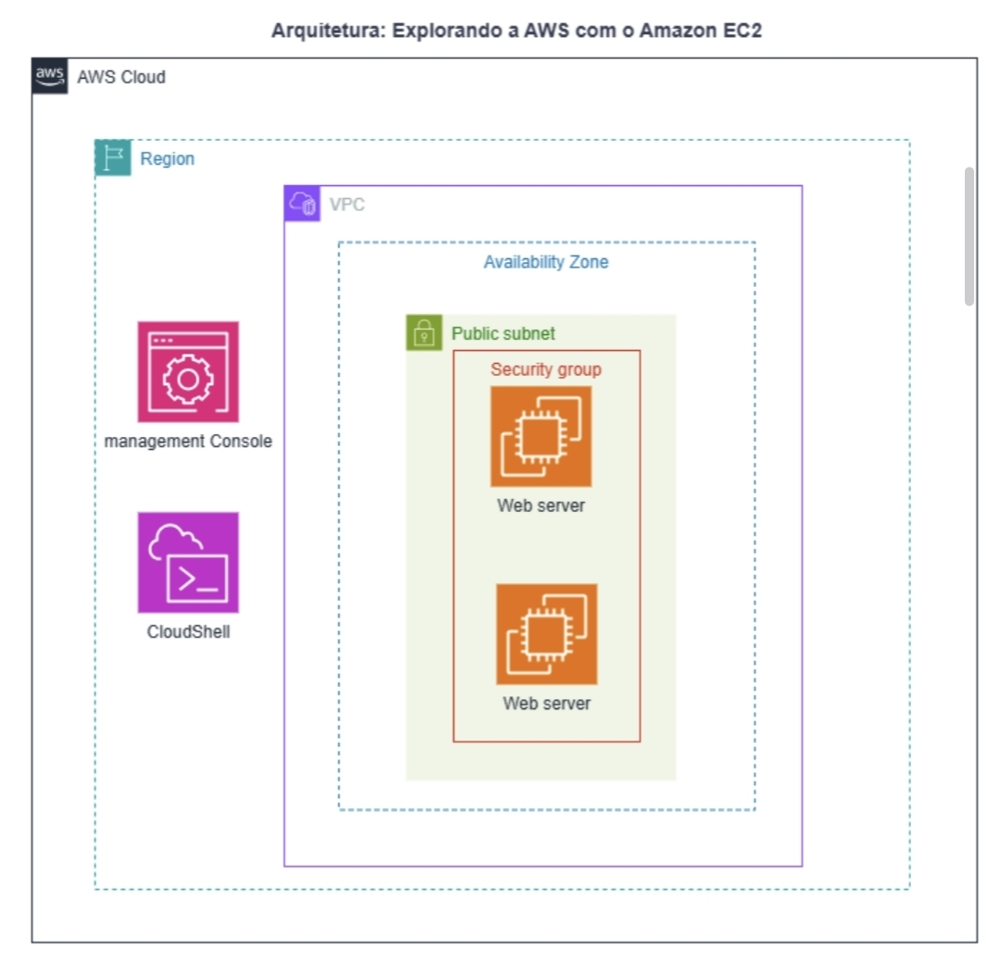

# Laboratório - Explorando a AWS com Amazon EC2 ☁️🚀

## Objetivo
Provisionar uma instância Amazon EC2 utilizando AWS CLI e CloudShell, configurar um Security Group permitindo HTTP e publicar uma página web simples utilizando Apache.

## Serviços AWS Utilizados
- Amazon EC2
- AWS CloudShell
- AWS CLI
- Security Groups
- Amazon Linux 2023

## Arquitetura

A arquitetura utiliza AWS CloudShell e AWS CLI para provisionar uma instância Amazon EC2 (Amazon Linux 2023), configurando um Security Group com acesso HTTP e implantando automaticamente um servidor Apache.

## Documentação

📄 [AWS EC2 Lab Report](docs/aws-ec2-lab-report.pdf)

## Funcionalidades
- Criação automática de Security Group
- Criação automática de Key Pair
- Provisionamento de instância EC2 t2.micro
- Instalação automática do Apache via User Data
- Disponibilização de página web de teste
- Exibição do IP público da instância
- Limpeza dos recursos criados

## Arquivos do Projeto

- `lab-ec2-escola-da-nuvem.sh` – Script de automação do laboratório
- `README.md` – Documentação principal do projeto
- `docs/aws-ec2-lab-report.pdf` – Relatório completo do laboratório
- `docs/images/aws-ec2-architecture-diagram.jpg` – Diagrama da arquitetura AWS

## Autor
Diego Henrique de Araújo  
Engenheiro Eletrotécnico | Estudante AWS Cloud Practitioner | Escola da Nuvem
